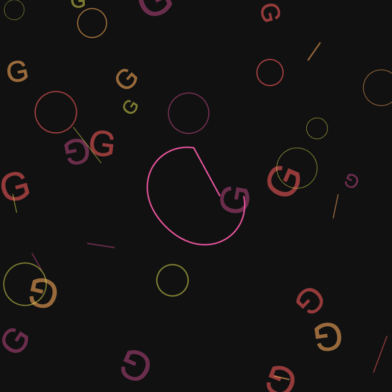
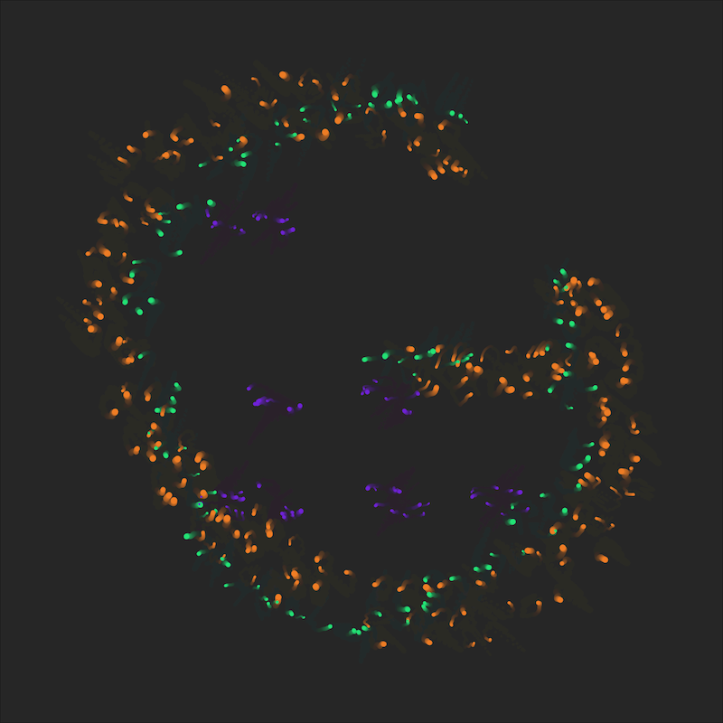
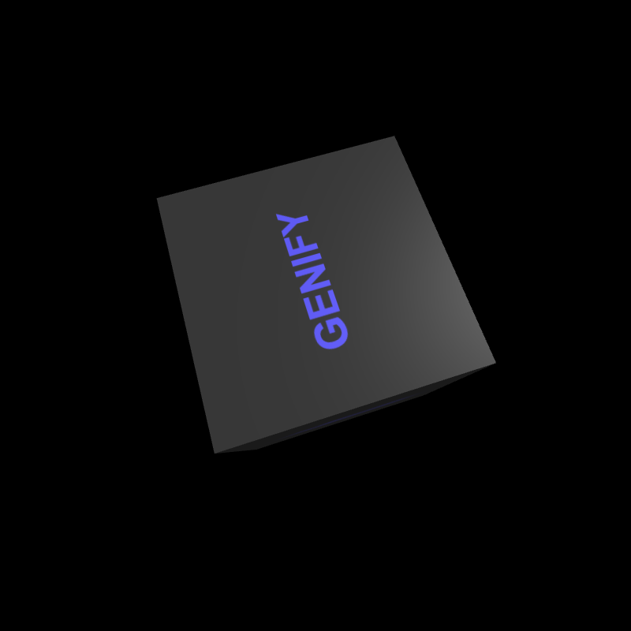

# Genify

A deterministic random number generator designed for generative art. It provides consistent random number generation based on a hash value, making it perfect for reproducible creative coding.

## Examples

Here are some examples of what you can create with Genify:

### Vanilla JS

[Download Example](archive/threejs.zip)

### P5.js

[Download Example](archive/p5js.zip)

### Three.js

[Download Example](archive/vanilla.zip)

### Creating Example Archives

When creating example archives, make sure to zip files from the root directory, not the folder itself. This ensures correct relative paths in the examples.

```bash
# ✅ Correct way: zip from root directory
cd examples/vanilla
zip -r ../../archive/vanilla.zip ./*

# ❌ Wrong way: don't zip the folder itself
cd examples
zip -r ../archive/vanilla.zip vanilla/  # This creates wrong path structure
```

Example directory structure inside zip should be:
```
vanilla.zip
├── index.html
├── genify.js
└── sketch.js

# Not:
vanilla.zip
└── vanilla/
    ├── index.html
    ├── genify.js
    └── sketch.js
```

## Features

- Deterministic random number generation
- URL-based hash parameter support (`genhash`)
- Simple and easy-to-use API
- Works with vanilla JavaScript, P5.js, and Three.js
- Render completion notification support
- Parent frame communication support

## Installation

Simply include genify.js in your HTML:

```html
<script src="genify.js"></script>
```

## Basic Usage

```javascript
// Get random number between 0 and 1
const value = genify.random();

// Get random integer between min (inclusive) and max (exclusive)
const number = genify.randInt(0, 10);

// Get random float between min and max
const decimal = genify.randFloat(0, 10);

// Get random item from array
const item = genify.choice(['red', 'green', 'blue']);

// Reset random generator
genify.reset();

// Set features for external communication
// IMPORTANT: All values must be strings!
genify.setFeatures({
    background: '255',          // ✅ Correct
    shape: 'circle',           // ✅ Correct
    count: '42',              // ✅ Correct
    size: 100.toString(),     // ✅ Correct
    invalid: 42,              // ❌ Wrong: number
    alsoInvalid: true         // ❌ Wrong: boolean
});

// Notify when rendering is complete
genify.renderDone();
```

## Feature Communication

### setFeatures(features)

The `setFeatures` method is used to communicate artwork characteristics to the parent frame. 

**Important**: All feature values MUST be strings. This is crucial for database compatibility and consistent behavior.

```javascript
// Correct usage
genify.setFeatures({
    color: '#FF0000',           // String ✅
    count: '5',                 // Number as string ✅
    size: (42.5).toString(),    // Float as string ✅
    enabled: 'true'             // Boolean as string ✅
});

// Incorrect usage
genify.setFeatures({
    color: '#FF0000',    // ✅
    count: 5,           // ❌ Number
    size: 42.5,        // ❌ Float
    enabled: true      // ❌ Boolean
});
```

## Using with P5.js

Important: When using with P5.js, you need to handle the random seed before any random operations:

```javascript
function preload() {
    let seed = ~~(genify.random() * 123456789);
    randomSeed(seed);
    noiseSeed(seed);
}
```

## Hash Parameter

The hash parameter in the URL determines the random seed:

```
https://your-site.com?genhash=0x123...
```

If no hash is provided, a random one will be generated. The hash should be 66 characters long (0x + 64 hex characters).

## API Reference

### Properties

- `genhash` - The current hash being used for random generation

### Methods

- `random()` - Returns a random number between 0 and 1
- `randInt(min, max)` - Returns a random integer between min (inclusive) and max (exclusive)
- `randFloat(min, max)` - Returns a random float between min and max
- `choice(array)` - Returns a random item from the array
- `reset()` - Resets the random number generator
- `setFeatures(features)` - Sets features for external communication (values must be strings)
- `renderDone()` - Notifies that the artwork rendering is complete

## Communication

Genify communicates with the parent frame through postMessage:

- When `setFeatures()` is called, sends a message with `id: "gen_getFeatures"`
- When `renderDone()` is called, sends a message with `id: "gen_renderDone"`

## Examples

See the examples directory for implementation samples:
- `examples/vanilla/` - Basic Canvas API example
- `examples/p5js/` - P5.js implementation
- `examples/threejs/` - Three.js 3D example

## License

MIT